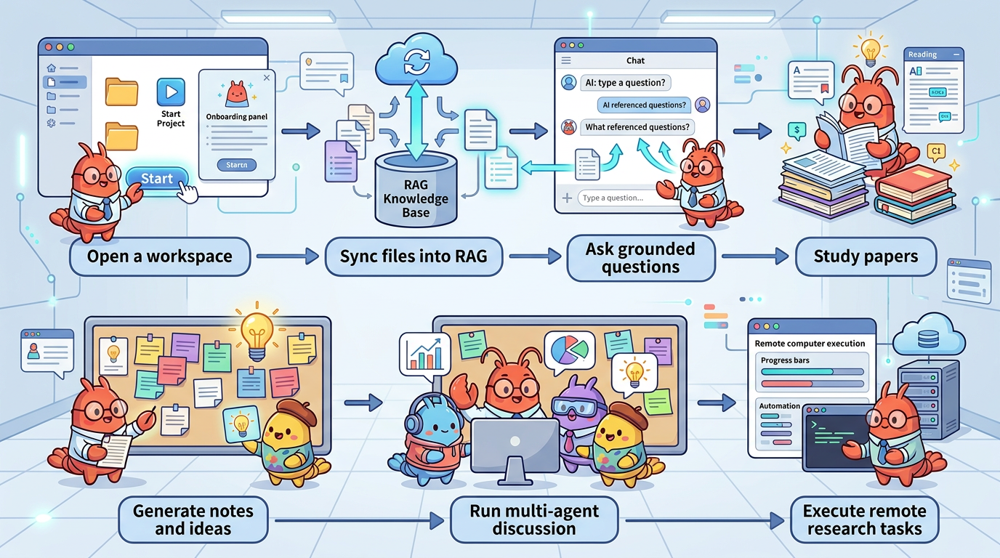

# InnoClaw

<p align="center">
  
</p>

<p align="center">
  <b>A self-hostable AI research workspace for grounded chat, paper study, scientific skills, and research execution.</b>
</p>

<p align="center">
  <i>Grounded over your files. Structured around papers. Ready for execution.</i>
</p>

<p align="center">
  <a href="LICENSE"></a>
  <a href="package.json"></a>
  <a href="https://github.com/SpectrAI-Initiative/InnoClaw/actions/workflows/ci.yml"></a>
  <a href="https://SpectrAI-Initiative.github.io/InnoClaw/"></a>
  <a href="https://github.com/SpectrAI-Initiative/InnoClaw/stargazers"></a>
  <a href="https://github.com/SpectrAI-Initiative/InnoClaw/issues"></a>
</p>

<p align="center">
  <b>English</b> · <a href="docs/README_CN.md">简体中文</a> · <a href="docs/README_JA.md">日本語</a> · <a href="docs/README_FR.md">Français</a> · <a href="docs/README_DE.md">Deutsch</a>
</p>

<p align="center">
  <a href="https://SpectrAI-Initiative.github.io/InnoClaw/">Documentation</a> · <a href="#quick-start">Quick Start</a> · <a href="#community-support">Community</a>
</p>

<p align="center">
  <a href="#community-support">
    
  </a>
  &nbsp;&nbsp;&nbsp;&nbsp;
  <a href="#community-support">
    
  </a>
  <br/>
  <sub>Scan to join our community · 扫码加入飞书/微信体验群</sub>
</p>

InnoClaw turns server-side folders into AI-native workspaces for grounded chat, paper study, scientific workflows, and research execution.

It is built for researchers, developers, labs, and self-hosters who want more than a generic chat UI: cited answers over real files, reusable skills, and a path from reading to execution.

<p align="center">
  
</p>

---

## 🔥 What's New

<!-- whats-new-start -->

#### 2026-03-20
- **Deep Research Module**: Full AI-driven scientific research pipeline with multi-phase orchestration, reviewer deliberation, execution planning, and workflow graph UI
- **Execution Pipeline**: Automated experiment execution system with Slurm job submission, dataset management, preprocessing, and remote executor support


#### 2026-03-19
- **ClawHub Skill Import**: New integration to import skills directly from ClawHub via a dedicated API endpoint and import dialog
- **Code Preview Panel**: New in-editor code preview component supporting syntax highlighting and save-status tracking
- **Paper Study Cache**: Persistent caching layer for paper study sessions, improving reload performance and state continuity


#### 2026-03-18
- **Multimodal Vision for Paper Analysis**: PDF images are now extracted and analyzed visually during paper discussion and research ideation sessions
- **Claude Code Skills Integration**: Import skills directly from local folders or Claude Code projects via a new dedicated import workflow


#### 2026-03-18
- **Multimodal Vision for Paper Discussion & Ideation**: Vision-capable providers can now receive extracted PDF page images alongside text so discussion and ideation agents can analyze figures, tables, and diagrams.
- **Paper Pages Gallery UI**: Discussion and ideation panels now show a collapsible thumbnail gallery for extracted paper pages with full-size preview dialogs.
- **Provider Vision Capability Detection**: Provider configs now expose vision support so routes can switch between multimodal and text-only paper context automatically.


#### 2026-03-17
- **Remote Job Profile Management & SSH Hardening**: Secure remote profile creation, editing, and SSH-hardened job submission for research execution
- **Rich Markdown Rendering in Agent Panel**: Agent messages now render tables, LaTeX math, and syntax-highlighted code blocks
- **API Provider Settings UI**: Configure AI provider API keys and endpoints directly from the Settings page


#### 2026-03-17
- **rjob Profile Config & Submission Hardening**: Remote profiles now store full rjob defaults (image, GPU, CPU, memory, mounts, charged-group, private-machine, env vars, host-network, example commands). `submitRemoteJob` builds the rjob command internally from stored config - the agent can no longer modify flags like `--charged-group` or `--image`. SSH transport fixed with `-o StrictHostKeyChecking=no -tt`, init script sourcing, and double-quote wrapping for correct quoting.
- **Profile Editing**: Edit button (pencil icon) on remote profiles in the Remotes tab. Click to load profile into the form for updating, including all rjob config fields.
- **Direct Job Submission Shortcut**: Agent-Long mode can skip inspect/patch/sync stages for simple job submissions: `listRemoteProfiles -> prepareJobSubmission -> approval -> submitRemoteJob`.


#### 2026-03-16
- **Paper Discussion & Ideation Robustness**: Per-role token budgets (2-2.5x increase), automatic retry on empty/short responses, and error visibility in the UI. Fixes agents returning empty or truncated output with reasoning-capable models (SH-Lab, Qwen, etc.)
- **Full Paper Context**: Discussion and ideation agents now receive up to 30k chars of the full paper text (local files) instead of just the abstract, enabling deeper analysis of methodology, experiments, and results
- **Abstract Extraction Fix**: Heuristic regex-based abstract extraction with improved AI prompt to prevent extracting author names instead of the actual abstract


#### 2026-03-14
- **Research Execution Engine**: New AI-driven research orchestration system with remote profiles, capability toggles, run history, and agent tools
- **Auto-updating README "What's New"**: GitHub Actions workflow that automatically generates and commits a What's New section daily

*No entries yet. This section is auto-updated when significant new features are detected by CI.*


<!-- whats-new-end -->

---

## 🧭 What Is InnoClaw?

InnoClaw is a self-hostable web app for research-centric knowledge work. It combines workspace management, retrieval-augmented chat, paper search and review, reusable scientific skills, and agent-based execution in one place.

Instead of juggling separate tools for files, notes, literature review, and automation, you keep the workflow in one workspace: open a folder, sync content, ask grounded questions, study papers, and run multi-step research tasks.

## ✨ Why InnoClaw

- **Workspace-first** - Treat server folders as durable research workspaces with files, notes, chat history, and execution context
- **Grounded AI answers** - Use RAG-backed chat with source citations over your own documents and code
- **Research-native workflows** - Study papers, run structured multi-agent discussions, and generate new directions from literature
- **Scientific skills built in** - Import and use 206 SCP scientific skills across domains such as drug discovery, genomics, and protein science
- **Execution, not just conversation** - Move from reading and planning to job submission, monitoring, result collection, and next-step recommendations
- **Self-hosted and multi-model friendly** - Run with OpenAI, Anthropic, Gemini, and compatible endpoints in your own environment

<a id="quick-start"></a>

## 🚀 Quick Start

```bash
git clone https://github.com/SpectrAI-Initiative/InnoClaw.git
cd InnoClaw
npm install
npm run dev
```

- Open `http://localhost:3000`
- Configure one AI provider from the Settings page
- Open or clone a workspace, then click `Sync` to build the RAG index
- Need OS-specific prerequisites or production setup? See `docs/getting-started/installation.md`

## 🛠️ What You Can Do

- Chat with local files and code using grounded citations
- Search, summarize, and review papers in one workspace
- Run 5-role structured paper discussions for critique and reproducibility thinking
- Generate summaries, FAQs, briefs, timelines, and research ideas
- Import scientific skills and trigger reusable domain workflows
- Manage remote research tasks with approval gates, monitoring, and result analysis

## 🗺️ Choose Your Path

| If you want to... | Start here | What happens next |
|-------------------|------------|-------------------|
| Chat with your own files | **Workspace + RAG Chat** | Open a folder, click `Sync`, and ask cited questions |
| Read and break down papers | **Paper Study** | Search papers, summarize them, then move into discussion or notes |
| Stress-test ideas with multiple perspectives | **Multi-Agent Discussion** | Run role-based reviews for critique, evidence gathering, and reproducibility thinking |
| Turn reading into new directions | **Research Ideation** | Generate directions, compare options, and save outputs into notes |
| Execute research work on remote infrastructure | **Research Execution Workspace** | Review code, approve changes, submit jobs, monitor runs, and collect results |

## 🧩 How It Fits Together

| Layer | Role in the workflow |
|-------|-----------------------|
| **Workspace** | Holds files, notes, session context, and project state |
| **Knowledge** | Syncs files into the RAG index so answers stay grounded |
| **Paper Workbench** | Handles literature search, summary, discussion, and ideation |
| **Skills** | Adds reusable domain workflows and tool-guided capabilities |
| **Execution** | Extends the workflow into remote jobs and experiment loops |

## 🔄 Core Workflows

### 📄 Paper Study

Search literature, preview papers, summarize them, and move directly into discussion or ideation.

- Search across multiple sources from one UI
- Use AI-assisted query expansion for broader coverage
- Open paper previews without leaving workspace context
- Save outputs into notes for reuse

### 🧠 Multi-Agent Discussion

Run a structured paper review with roles such as moderator, librarian, skeptic, reproducer, and scribe.

- Follow a deterministic staged discussion flow
- Compare evidence, methods, limitations, and reproducibility concerns
- Generate review records that are easier to scan than free-form chats
- Use full-paper context for deeper analysis

### 🧪 Research Execution Workspace

Go from code inspection to job submission and result analysis inside a guided execution workflow.

- Review repositories and propose patches with agent assistance
- Gate high-risk steps with explicit approval checkpoints
- Submit jobs through Shell, Slurm, or `rjob` backends
- Monitor status, collect artifacts, and generate recommendations for the next step

## 📦 Feature Snapshot

| Feature | What it enables |
|---------|------------------|
| Workspace Management | Map server folders into persistent AI workspaces |
| File Browser | Browse, upload, create, edit, preview, and sync files |
| RAG Chat | Ask grounded questions over indexed files with citations |
| Paper Study | Search, summarize, and inspect papers in one place |
| Discussion Mode | Run structured multi-role paper discussions |
| Research Ideation | Generate new directions and cross-disciplinary ideas |
| Skills System | Import reusable scientific and workflow skills |
| Research Execution | Orchestrate remote experiment loops with monitoring and approval gates |
| Multi-Agent Sessions | Keep separate execution contexts across tabs and projects |
| Multi-LLM Support | Use OpenAI, Anthropic, Gemini, and compatible endpoints |

## 📚 Documentation

- **Start here** - [Overview](docs/getting-started/overview.md), [Installation](docs/getting-started/installation.md)
- **Configure and deploy** - [Deployment](docs/getting-started/deployment.md), [Environment Variables](docs/getting-started/environment-variables.md), [Configuration](docs/usage/configuration.md)
- **Use the product** - [Features](docs/usage/features.md), [API Reference](docs/usage/api-reference.md)
- **Troubleshoot and contribute** - [Troubleshooting](docs/troubleshooting/faq.md), [Development Guide](docs/development/contributing.md)

<a id="community-support"></a>

## 💬 Community & Support

- **Need setup or usage help?** Start with the docs at https://SpectrAI-Initiative.github.io/InnoClaw/
- **Found a bug or want a feature?** Open an issue at https://github.com/SpectrAI-Initiative/InnoClaw/issues
- **Want direct discussion?** Join the Feishu community from `docs/README_CN.md`

## ℹ️ Project Info

- **License** - Apache-2.0, see `LICENSE`
- **Repository** - https://github.com/SpectrAI-Initiative/InnoClaw
- **Docs** - https://SpectrAI-Initiative.github.io/InnoClaw/

## ⭐ Star History

[](https://star-history.com/#SpectrAI-Initiative/InnoClaw&Date)
